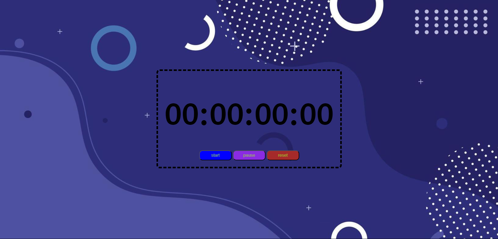

## Stopwatch

A simple stopwatch built with JavaScript, HTML, and CSS. Features start, stop, and reset functionality.

### How to Use
1. Open `index.html` in a browser.
2. Click "Start" to time.
3. Click "Stop" to pause.
4. Click "Reset" to clear.
